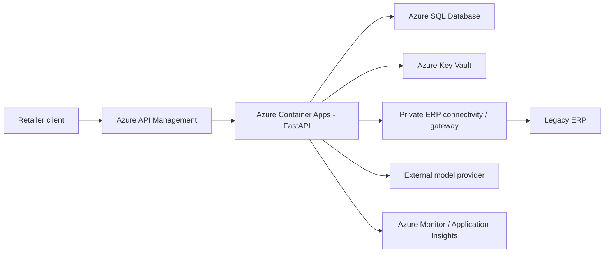

# Azure Architecture and Operations Plan

## Assumptions and architecture

Assumptions: 100 retailers share one service; every request has a tenant API credential;
10,000 requests/day with bursts to 20 requests/second; order lookups and a third-party
model are synchronous initially; customer messages may contain personal data; the team
has limited on-call capacity. No Azure deployment or load test was performed.



Day one: API Management validates caller credentials and throttles, Container Apps runs
the stateless Python API, Azure SQL stores policy/audit rows, Key Vault stores provider
and ERP secrets, and Azure Monitor captures redacted telemetry. Use an internal Container
Apps ingress behind APIM. Azure SQL is the relational choice for managed backups, Entra
integration, and familiar operational controls; a PostgreSQL Flexible Server is a viable
lower-lock-in alternative but changes identity and connection configuration. SQLAlchemy
keeps the query/data-access boundary portable. The local application currently uses
SQLite; production schema changes require a versioned migration step.

```text
DATABASE_URL=<Key-Vault-backed Azure SQL connection configuration>
ERP_BASE_URL=<private ERP endpoint placeholder>
MODEL_API_KEY=<Key Vault secret reference>
MODEL_TIMEOUT_SECONDS=5
```

All values above are placeholders, not deployable settings. No credentials belong in the
container image or repository.

## Identity, secrets, and tenant boundary

APIM authenticates each retailer using a distinct subscription credential or OAuth client
credential and applies per-client quotas. The API still maps the validated credential to
an immutable server-side retailer ID; it never accepts a tenant ID from the ticket body.
For 100 retailers, use a managed credential-to-tenant store rather than environment
variables. Tenant identity is carried in a typed request context and added to every ERP
and SQL query. SQL policy reads filter by both tenant and policy/category in the database.
Audit access is restricted to operations roles and always tenant-scoped for customer
support views.

Container Apps uses a system-assigned managed identity. Grant it only `get` access to the
specific Key Vault secrets it needs and database-level read access to policy plus insert
access to audit rows through Microsoft Entra database authentication. A separate
deployment identity uses GitHub Actions OIDC federation, can push to the target ACR and
update the named Container App, but cannot read production secrets. ERP credentials and
the external model key are separate Key Vault secrets with named owners, expiry alerts,
and staged rotation. Do not emit secret values, message bodies, order references, or
connection strings in logs. Apply a short, documented retention period to request
telemetry and a separate retention policy for audit records.

## ERP connectivity and isolation

Prefer private connectivity from the Container Apps environment to the ERP network using
site-to-site VPN or ExpressRoute. If the ERP cannot expose a stable private API, place a
self-hosted gateway/connector near it and restrict inbound routes to the application
subnet and expected service identity. Keep the adapter contract stable while replacing
the local file adapter with the ERP API. Bound connection-pool size and request deadline
to the ERP's supported capacity. If ERP work becomes slow or bursty, an Azure Service Bus
queue and worker can protect the ERP, but that changes the request contract to return a
pending job ID; do not silently queue a synchronous endpoint.

The tenant boundary is enforced twice: APIM credential-to-retailer mapping and the
application's retailer-scoped repository/ERP calls. A cross-tenant order reference must
be indistinguishable from an unknown reference. Database row-level security is a useful
defense-in-depth addition, not a substitute for explicit query predicates and isolation
tests.

## Deployment and rollback

```text
merge
 -> build immutable image
 -> unit tests and static checks
 -> integration tests against disposable relational database
 -> run backward-compatible database migration once
 -> deploy a new Container Apps revision
 -> verify readiness/health and run authenticated smoke tests
 -> shift a small traffic percentage and inspect release gates
 -> promote, or restore previous revision on failure
```

GitHub Actions should use OIDC, not a stored Azure client secret. Migration runs as a
one-off job with a database role limited to schema changes; the runtime role cannot alter
schema. Seed/upsert policy text is reviewed with migrations. Require healthy dependency
checks, no new authentication/isolation failures, and stable p95/error rates before
promotion. Roll back the app revision first; use expand/contract migrations so the old
revision remains compatible. If a data migration is irreversible, take a verified backup
and document restore time/objectives before release. Validate this pipeline in a
non-production subscription before relying on it; it is a plan only.

## Scaling, latency, and cost

At 20 requests/second and an eight-second model call, Little's Law gives about
`20 * 8 = 160` model-dependent requests in flight. Set Container Apps concurrency and
replica ceilings from measured CPU/memory and provider quotas, not only request count.
Use a short per-call timeout, no unbounded retries, and a small bounded retry only for
explicitly safe transient errors if provider guidance permits it. Apply a semaphore and
per-tenant/APIM rate limits; reject overload with a clear retryable response or return a
pending ID only after adopting a queue contract. Circuit-break repeated provider errors.
ERP connection limits need their own pool and concurrency cap so model waits do not hold
ERP connections. The current synchronous implementation falls back to human review on
failure; it has not been load-tested.

Main variable costs are Container Apps replicas, Azure SQL compute/storage/backups,
private ERP connectivity, model tokens/requests, and telemetry ingestion/retention. SQL,
VPN/ExpressRoute, and reserved minimum replicas can cost money while idle. Measure requests,
tokens, provider latency, SQL utilization, ERP concurrency, and log volume by environment
and tenant. Enforce token/request budgets, redact and sample routine telemetry, and alert
on spend and unusual growth. No exact Azure pricing is asserted.

Unknown until validated: Container Apps scaling under the chosen limits, end-to-end p50/
p95, SQL pool behavior, real ERP latency/availability and network routes, provider quota
and rate-limit behavior, identity assignments, migration safety, and costs. Validate with
representative load tests and a staged pilot before production traffic.